<div align="center">
  <picture>
    <source media="(prefers-color-scheme: dark)" srcset="docs/assets/logo-white.png">
    
  </picture>

  <h1>Rereflect</h1>

  <p><strong>Open-source, self-hosted feedback intelligence.</strong><br>
  Turn raw customer feedback into sentiment, pain points, feature requests and churn risk — on your own infrastructure, with your own LLM key.</p>

  <p>
    <a href="LICENSE"></a>
    <a href="https://github.com/haqaliz/rereflect/stargazers"></a>
    <a href="https://github.com/haqaliz/rereflect/issues"></a>
    <a href="https://github.com/haqaliz/rereflect/commits"></a>
    
    
    <a href="CONTRIBUTING.md"></a>
  </p>

  <p>
    <a href="#-quick-start">Quick Start</a> ·
    <a href="docs/SELF_HOSTING.md">Self-Hosting</a> ·
    <a href="docs/DEVELOPMENT.md">Development</a> ·
    <a href="docs/API.md">API</a> ·
    <a href="docs/ARCHITECTURE.md">Architecture</a> ·
    <a href="https://rereflect.ca">Website</a>
  </p>

  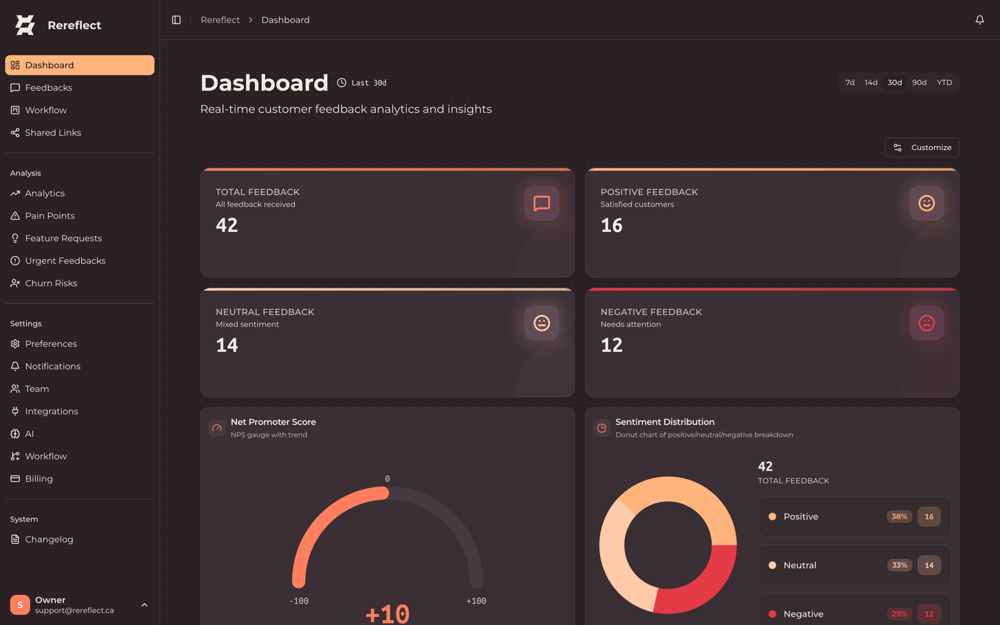
</div>

---

## What is Rereflect?

Rereflect ingests customer feedback from CSV, email, webhooks and Slack, then uses
NLP and (optionally) an LLM to classify sentiment, surface pain points and feature
requests, flag urgent churn risks, and route everything through a team workflow —
all behind a multi-tenant dashboard you host yourself.

- 🔓 **100% open source (MIT).** No "open core", no locked features.
- 🏠 **Self-hosted — your data never leaves your box.** Ships with Docker Compose.
- 🔑 **Bring your own LLM key.** OpenAI, Anthropic or Google, encrypted at rest. There is no vendor key and nothing is proxied.
- 💸 **Free by default.** Runs end-to-end on a local VADER + keyword pipeline with **no API key and zero cost**. Add a key only when you want LLM-grade analysis.
- ✅ **Everything unlocked.** No tiers, seat caps, or feedback quotas — advanced churn, cohorts, analytics, integrations and the API are all included.

## Highlights

| | |
|---|---|
| 🧠 **AI feedback analysis** | Sentiment, pain points, feature requests, urgency and topic clustering — local (VADER) or LLM-powered (BYOK). |
| 📉 **Churn risk scoring** | Per-item churn risk with suggested actions, plus cohort analytics and playbooks. |
| 🗂️ **Team workflow** | Kanban board, statuses, auto-assignment rules and round-robin routing. |
| 🔌 **Sources & integrations** | CSV import, email, webhooks and Slack in; alerts and digests out. |
| 📊 **Analytics & sharing** | Trends, distributions and top-insight tables, exportable to PDF and shareable via signed links. |
| 👥 **Multi-tenant + RBAC** | Organization isolation with Owner / Admin / Member roles. |

## 🚀 Quick Start

The fastest path is Docker Compose — it brings up Postgres, Redis, the backend, the
Celery worker and the frontend together.

```bash
git clone https://github.com/haqaliz/rereflect.git
cd rereflect

# 1. Copy the env template and fill in the required secrets
cp .env.prod.example .env

# 2. Generate the two required secrets and paste them into .env
python -c "import secrets; print('JWT_SECRET=' + secrets.token_urlsafe(48))"
python -c "from cryptography.fernet import Fernet; print('LLM_ENCRYPTION_KEY=' + Fernet.generate_key().decode())"

# 3. Build and start everything
docker compose -f docker-compose.prod.yml up -d --build
```

Open **http://localhost:3000** and sign in with the `ADMIN_EMAIL` / `ADMIN_PASSWORD`
you set in `.env` (the first admin is seeded on startup). The API and interactive
docs live at **http://localhost:8000/docs**.

> Out of the box (`ai_analysis_enabled=false`, no LLM key) Rereflect runs the **free
> local pipeline** — sentiment, pain points, feature requests and heuristic churn all
> work with no external API and no cost. Add a key in **Settings → AI** whenever you
> want LLM-grade results.

👉 Full deployment guide, env reference and BYOK setup: **[docs/SELF_HOSTING.md](docs/SELF_HOSTING.md)**.
Developing locally instead of via Docker? See **[docs/DEVELOPMENT.md](docs/DEVELOPMENT.md)**.

## Screenshots

### Dashboard & analytics
Real-time KPIs, NPS, sentiment distribution and trend analytics — with exportable,
shareable views.

<p align="center">
  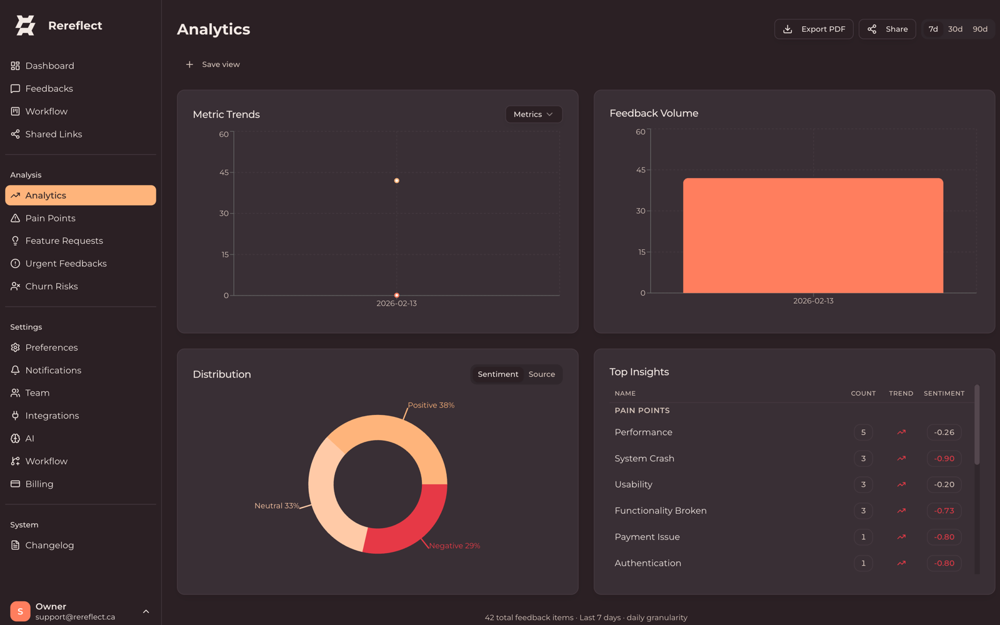
  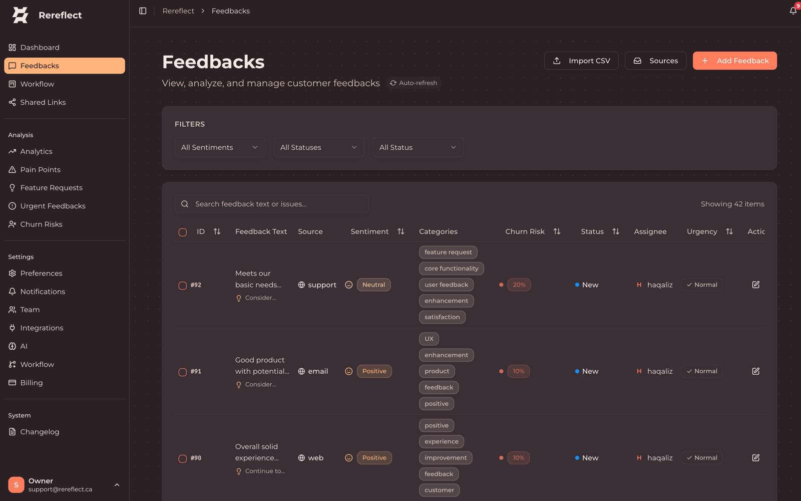
</p>

### AI analysis: pain points, feature requests & urgent flags
Every feedback item is automatically categorized, tagged and prioritized.

<p align="center">
  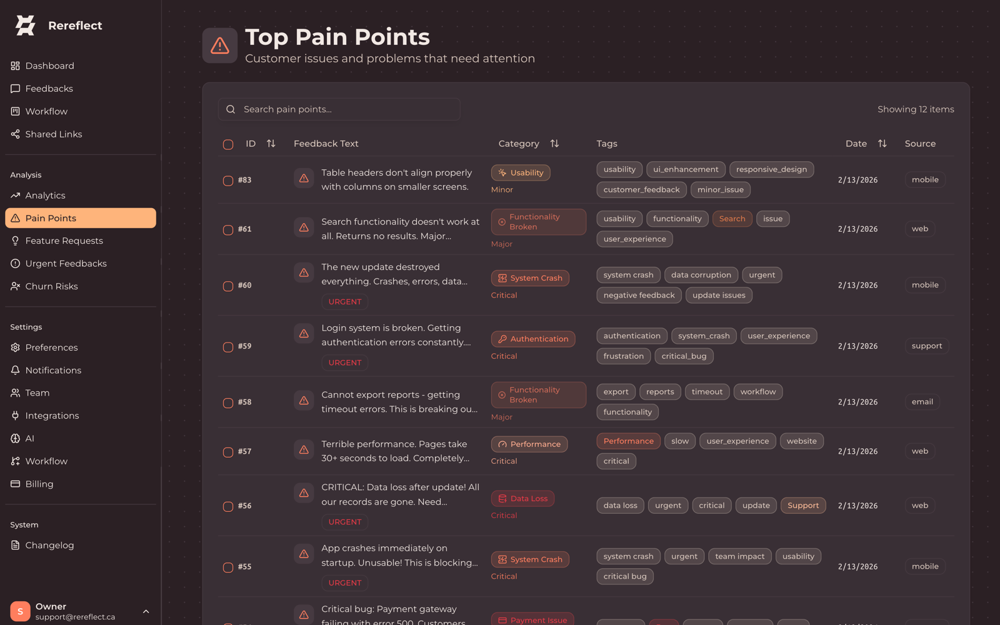
  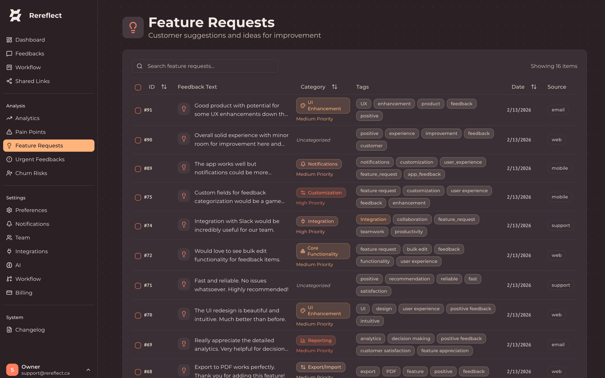
  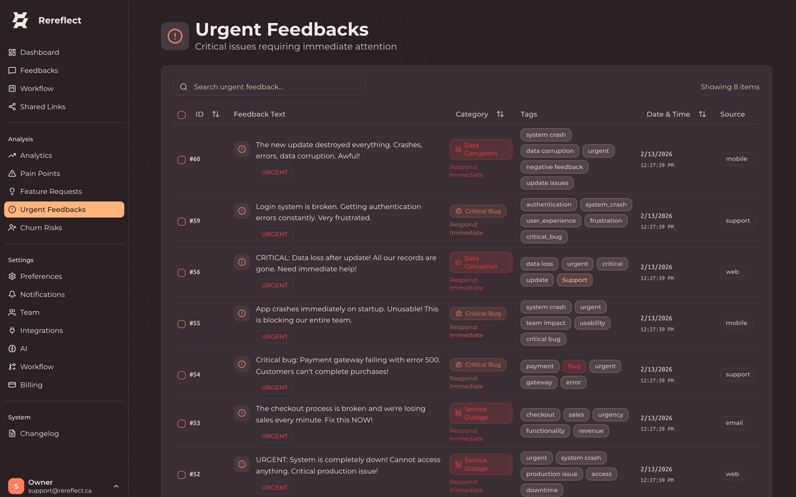
  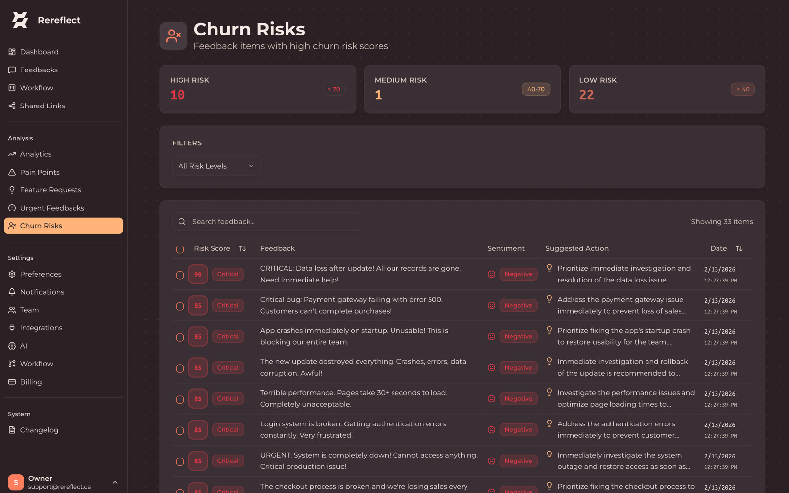
</p>

<details>
<summary><strong>More screenshots</strong> — workflow, sources, integrations & settings</summary>

<br>

| Workflow board | Feedback sources |
|---|---|
| 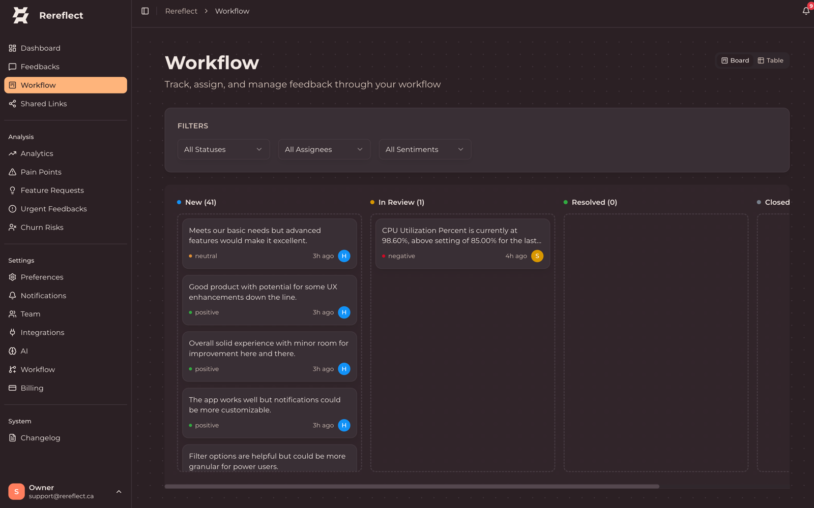 | 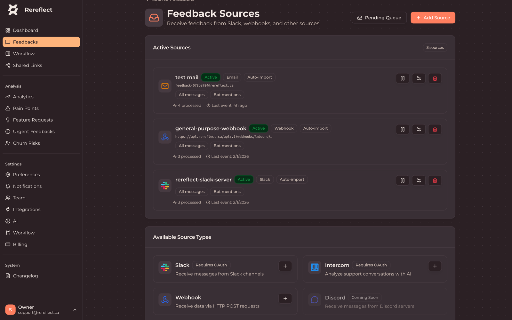 |
| **Integrations** | **AI (bring your own key)** |
| 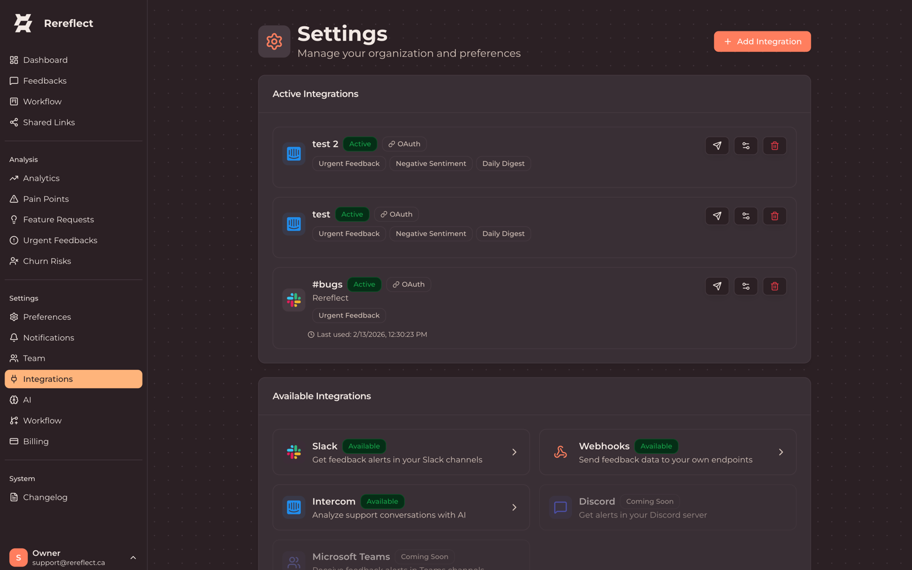 | 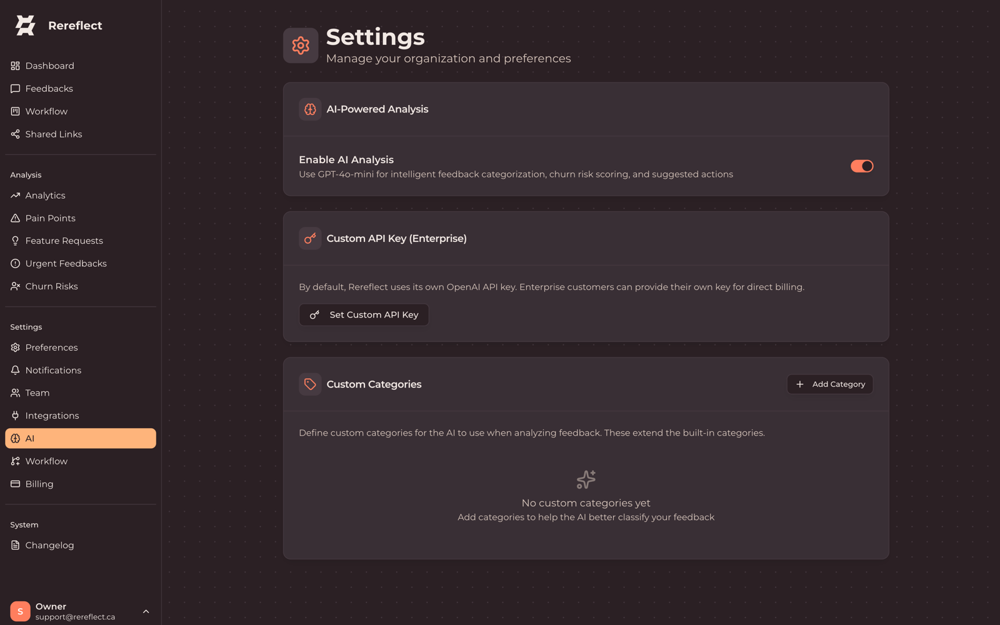 |
| **Auto-assignment rules** | **Notifications & digests** |
| 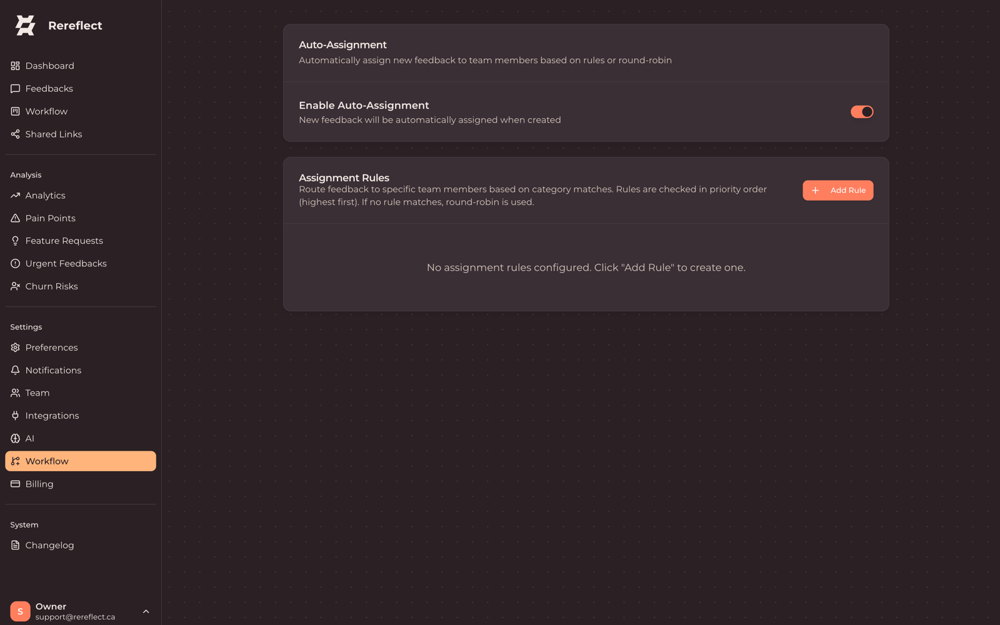 | 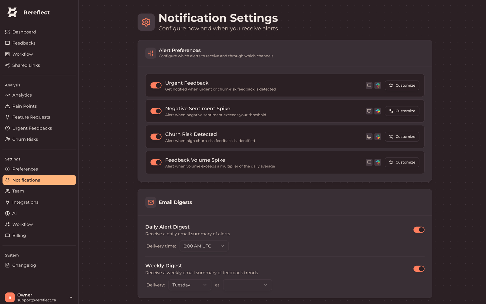 |
| **Team & roles** | **Shared links** |
| 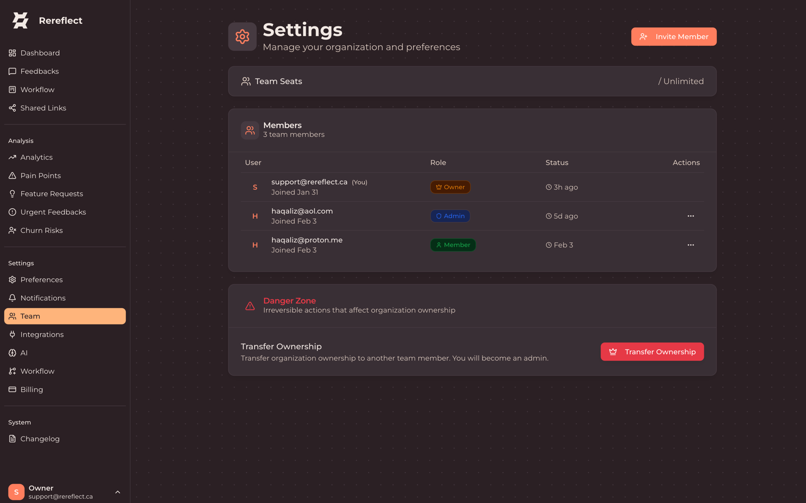 | 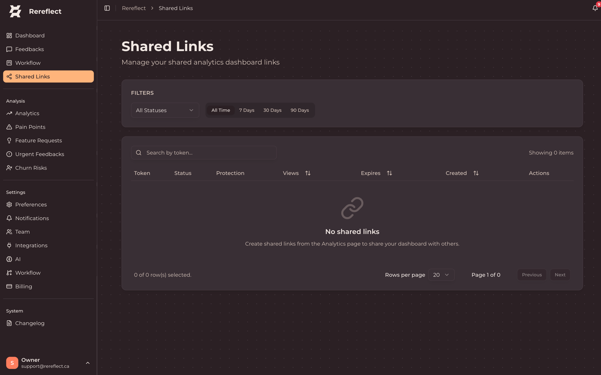 |

</details>

## Architecture

```
┌─────────────────┐
│  frontend-web   │  Next.js 16 + TypeScript + TailwindCSS
└────────┬────────┘
         │ REST API
         ▼
┌─────────────────┐
│   backend-api   │  FastAPI + PostgreSQL + SQLAlchemy
└────────┬────────┘
         │
    ┌────┴────┐
    ▼         ▼
┌────────┐ ┌────────────┐
│analysis│ │  worker-   │  Celery + Redis
│-engine │ │  service   │
└────────┘ └────────────┘
```

A Next.js frontend talks to a FastAPI backend; long-running analysis runs on a Celery
worker (Redis broker) using the analysis engine (VADER / scikit-learn / BERTopic, or an
LLM when a key is configured). Full breakdown, tech stack, project layout and the RBAC
model are in **[docs/ARCHITECTURE.md](docs/ARCHITECTURE.md)**.

## Documentation

| Guide | What's inside |
|-------|---------------|
| **[Self-Hosting](docs/SELF_HOSTING.md)** | Docker Compose deployment, full env reference, BYOK, TLS and the $0 local mode |
| **[Development](docs/DEVELOPMENT.md)** | Local setup, the pnpm + Python toolchain, package management, common commands, troubleshooting |
| **[API Reference](docs/API.md)** | REST endpoints, auth, pagination and filtering (live Swagger at `/docs`) |
| **[Architecture](docs/ARCHITECTURE.md)** | Services, tech stack, project structure and RBAC |
| **[Contributing](CONTRIBUTING.md)** | Dev workflow, testing and PR conventions |

## Tech stack

- **Frontend** — Next.js 16 · TypeScript 5.9 · TailwindCSS 3.4 · shadcn/ui · Recharts
- **Backend** — FastAPI 0.115 · SQLAlchemy 2.0 · Alembic · PostgreSQL · JWT
- **Async** — Celery 5.3 · Redis
- **AI/ML** — VADER · scikit-learn · BERTopic · OpenAI / Anthropic / Google (BYOK)

## Contributing

Contributions are welcome — bug reports, features, docs and tests. See
**[CONTRIBUTING.md](CONTRIBUTING.md)** for dev setup, testing and PR conventions.

## License

Released under the **[MIT License](LICENSE)**. Third-party attributions are in
**[NOTICE](NOTICE)**.

<div align="center">
  <br>
  <strong>Rereflect is free and open source. Self-host it, hack on it, make it yours.</strong>
  <br><br>
  <sub>If it's useful to you, consider leaving a ⭐ — it helps others find the project.</sub>
</div>
